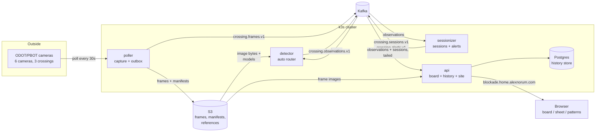

# Blockade architecture

This is the current-truth description of how Blockade works: what each piece owns, the contracts between them, and how to operate it.
The original proposals live in [docs/history/](history/) as a record of what was planned; where they disagree with this document, this document wins.

## The system in one picture

One detection, one event stream, everything downstream is a consumer.
Image bytes never enter Kafka: topics carry metadata and a reference into S3, always.

## The two ownership rules

Everything about storage follows from two rules.

**Streaming owns now; batch owns history.**
The live path (poller to detector to sessionizer to the board) produces the record as it happens.
When a detector improves, history is corrected by the batch path instead: `blockade-detect scan` re-scores the kept frames and `blockade-api backfill` loads the result into Postgres.
History is never replayed through the live services - that would corrupt their state - and the backfill refuses any window that reaches within one session gap of now, because that edge still belongs to streaming.

**The live board reads memory; history surfaces read Postgres.**
"Is a train blocking right now" is answered from an in-memory state the API rebuilds by replaying Kafka on every boot - it works even with the database down.
"What happened last Tuesday" is answered only from Postgres; without it `/timeline` and `/sessions` return 503 rather than a half-true answer from a memory buffer.
`/analytics` is the one deliberate exception: it answers 200 with `{"available": false, "crossings": {}}`, because the UI needs to hide the stats surface entirely rather than render an error in place of it.

## Components

### poller (`services/poller`, deploy/poller)

Owns capture, and capture is sacred: ODOT overwrites each image within the minute, so a missed frame is data nobody can ever recover.
Polls each rostered camera every 30s with conditional GETs, dedupes by content hash, writes every frame to the local cache and S3, and appends one `FrameRecord` line per tick to an hourly JSONL manifest.
The manifest is the append-only source of truth and doubles as the outbox: a sibling task tails it and publishes to `crossing.frames.v1`, advancing a per-camera position file only after broker acks.
A Kafka outage therefore costs publish latency, never a frame; deleting a position file replays the corpus from local manifests.
Runs with `strategy: Recreate` (two pollers would double ODOT's request rate) and no CPU limit (throttling would skew `captured_at`).
CLIs: `blockade-capture` (run/once), `blockade-inventory` (fetch/list/resolve - regenerates `config/cameras.yaml` from the ODOT inventory), `blockade-sync` (S3 repair).

### detector (`services/detector` + `libs/blockade-core/src/blockade/detect/`, deploy/detector)

Turns frames into `ObservationRecord`s: one judgement (BLOCKED / CLEAR / UNKNOWN, confidence, reason) per crossing per tick.
UNKNOWN is a first-class honest answer; a detector must never raise and never guess.
Cameras whose view does not include the crossing carry `scores: false` in the roster (today 677 and 679): they emit zero-inference UNKNOWNs stamped `unscored/1`, so the board keeps their pictures while consensus, sessions, alerts, and analytics all ignore them.
That covers new rows; their historical judgements stay authoritative for past instants until a re-score and backfill layers `unscored/1` over them - which has to re-score the crossing's other cameras in the same pass, because that is what rebuilds its sessions.
Every record is stamped with the `detector_version` that produced it, so rows from different detectors are never silently mixed.

Detectors are interchangeable by config (`BLOCKADE_DETECTOR`); production runs `auto`, a per-camera router:

- `classifier` - per-camera MobileNetV3-small ONNX models, used wherever `references/classifier-{camera_id}.onnx` exists in S3.
  Shipping a new camera's model is an S3 upload plus a rollout restart; no code change.
- `reference` - the free fallback for untrained cameras: brightness-binned median references with per-pixel spread thresholds, per-camera calibrated, restricted to a data-derived track band.
- `vlm` - Claude Haiku reads the scene; used by the `spotcheck` label-growing tool, not in the live path.

CLIs: `blockade-detect run` (the streaming service), `scan` (batch re-score for backfills), `explain <image>` (score one frame with the production build), `band <camera>` (derive the track band from hand-labeled blocked frames), `spotcheck` (VLM label sweep).
The accuracy loop - label sources by trust, training, the exam gate, shipping, backfilling - is a workflow, not a service; it is documented in [docs/training.md](training.md).

### sessionizer (`services/sessionizer` + `libs/blockade-core/src/blockade/{stream_sessions,alerts}.py`, deploy/sessionizer)

Turns observations into blockage sessions and rising-edge alerts.
The decisions live in two pure, heavily tested core classes; the service is their host.
`StreamingSessionizer` applies the gap rule (a session ends after ten quiet minutes) one observation at a time and is diffed in tests against `sessions.derive_sessions`, the batch oracle that sees whole history - two independent implementations that must agree.
`RisingEdgeAlerter` fires once per blockage at its leading edge (two confirmations to fire, three clears to re-arm) into `crossing.alerts.v1`, which has no consumer yet - the notifier is the next feature.

Recovery is replay: state is a pure function of the observations log, so every boot re-reads the topic and rebuilds open sessions with their original `started_at`.
A committed consumer-group offset serves as an emission boundary only - records below it rebuild state silently (they were published in a previous life; re-publishing would resurrect rows a backfill deleted), records past it emit normally, which is exactly what arrived while the pod was down.
Offsets commit only at the head after a sweep, making "committed" mean "everything due then was announced".
Session closes fire on wall clock past the gap deadline plus a two-minute drift allowance, and only at the head of the topic, so a backlog drain can never close a session early.

### api (`services/api`, deploy/api, deploy/postgres)

One pod serving both the JSON API and the static site, plus the Postgres materializer.

- **Board** (`/api/v1/status`, `/api/v1/events` SSE, frames): `LiveState` in `blockade-core/api/state.py` is a pure reducer rebuilt on every boot by groupless Kafka tailers; readiness gates traffic until the replay passes boot-time end offsets.
  Consensus is blocked-biased (any fresh BLOCKED wins; a glare-blind camera's CLEAR cannot veto its partner's train) and anything older than six minutes is stale, so a dead detector can never leave BLOCKED frozen on screen.
- **Materializer**: two grouped consumers upsert observations and sessions into Postgres, committing offsets only after the transaction - at-least-once, absorbed by deterministic keys.
- **History** (`/api/v1/timeline`, `/sessions`, `/analytics`): plain SQL in `db.py`; analytics buckets are corridor-local (America/Los_Angeles) via SQL `AT TIME ZONE`.
- **Backfill** (`blockade-api backfill obs.jsonl`): loads a re-scored window; see the data contract below.
- **Frames** (`/api/v1/frames/...`): S3 reads behind a content-addressed disk LRU, with a path-pattern guard.
- **Web** (`web/`): static Astro build baked into the image; three pages, one Preact island each - the board (schematic corridor map, SSE, time scrubber), the train sheet, and patterns.
  `npm run check` typechecks under Astro strict; CI runs it for web changes.

### Postgres (deploy/postgres)

The history store, on the 12TB disk.
Everything in it is derived and replayable from Kafka and S3; losing it is an inconvenience, not data loss.
Schema is `CREATE TABLE IF NOT EXISTS` on API start - at this scale a migration framework is ceremony.

## Data contracts

### Kafka topics

| Topic | Key | Producer | Consumers | Semantics |
| --- | --- | --- | --- | --- |
| `crossing.frames.v1` | camera_id | poller outbox | detector | at-least-once; payload is the manifest line, byte for byte |
| `crossing.observations.v1` | crossing_id | detector | sessionizer, api tailer | at-least-once; 7-day retention; the dataset's live edge |
| `crossing.sessions.v1` | session_id | sessionizer | api tailer, api materializer | compacted; one row per session survives, the latest emission |
| `crossing.alerts.v1` | crossing_id | sessionizer | none yet | rising edges only; the future notifier's feed |

Keys are an ordering contract: all records for one key land on one partition, which is the only reason a consumer may assume per-camera or per-crossing order.
Producers use acks=all and idempotence; consumers commit offsets only after their output is durable.

### Postgres tables

`observations` is append-only and versioned: primary key `(camera_id, captured_at, detector_version)`, and reads resolve latest-`ingested_at`-wins per `(camera_id, captured_at)`.
That layering is where retroactive honesty lives - a better detector's backfill adds a newer layer, and every read surface (timeline, scrubber, analytics) resolves to it without rewriting history.

`sessions` is a projection of observations: primary key `(session_id, detector_version)`, upserted by the materializer, and read latest-ingest-wins per `session_id`.
A backfill deletes every session starting inside the re-scored window and inserts the fresh derivation in one transaction - a session whose boundaries changed gets a new deterministic id, so upserts alone would leave the old wrong row standing.

`session_id` is `sha256(crossing_id | started_at-in-UTC)`, assigned when a session opens and never regenerated - the idempotency key the whole replay story leans on.

### S3 layout (`pdx-trainspotter`)

- `frames/{camera_id}/{Y}/{m}/{d}/{H}/{epoch_ms}-{hash8}.jpg` - the corpus, content-addressed, kept forever; the reason history can always be re-derived at better accuracy.
- `manifests/{camera_id}/.../{H}.jsonl.gz` - hourly-rolled manifest uploads; with the poller PVC these are the backfill source.
- `references/{camera_id}.npz|.json` and `references/classifier-{camera_id}.onnx` - detector models; every detector pod syncs the prefix at boot.

Model weights never live in git; they ship through this prefix.

## Deploy and operations

ArgoCD tracks `main` and applies `deploy/` recursively - edit the repo, not the cluster.
Cluster-wide platform (Kafka/Strimzi, Prometheus, ArgoCD itself) lives in the homelab repo; everything specific to Blockade lives here under `deploy/`, next to what it deploys.
Images build per service on merge (QEMU arm64, GHCR, `:latest` + SHA tags); a new image reaches pods via rollout restart.
All code changes go through the no-mistakes gate on a feature branch; nothing lands on main directly.

Imperative, never in git: the `aws-roles` Secret (IRSA role ARNs), `odot-credentials`, `postgres-credentials`, `regcred`, and the `blockade-cameras` ConfigMap.
When the roster schema gains a field, roll images before recreating the ConfigMap; when it loses one, recreate the ConfigMap first - `Camera` is `extra="forbid"` in both directions.

Monitoring: the poller, detector, and sessionizer each expose Prometheus metrics on :9102 with a ServiceMonitor, and the poller's `deploy/poller/alerts.yaml` carries the rules that matter, including `BlockadePollerMetricsMissing` - the absent() rule that fires when the poller's own series stop arriving and every other poller rule has therefore gone blind.
The api is the gap: it publishes only :8000, has no metrics and no ServiceMonitor, so the pod serving the board, the SSE feed, the history endpoints, and the materializer is unscraped.
A deploy-manifest test asserts every ServiceMonitor actually selects a Service, because the one time it didn't, all alerting was silently dead for two days.

### Common tasks

- **Retrain a camera**: follow [docs/training.md](training.md) (label, train, exam against gold labels, `aws s3 cp` the ONNX to `references/`, rollout restart the detector, then backfill the improved history).
- **Backfill after a detector change**: `blockade-detect scan --until <now-20min>` over *every* camera on the crossing, then `blockade-api backfill obs.jsonl --dry-run`, then for real; only the re-scored crossing's history changes.
  Scanning one camera of a two-camera crossing is the trap: the sessions are derived from all its witnesses at once, so a partial scan rebuilds the window from half the evidence, and a scan of a `scores: false` camera rebuilds it from none.
  The plan reads the roster and refuses any window whose crossing has a scoring camera missing from the scan, and the load refuses a second time if a window would end up with no sessions at all; `--allow-empty-window` is the deliberate override for windows that predate a camera or whose sessions really were phantoms.
  The step-by-step runbook, including reaching Postgres, is in [services/api/README.md](../services/api/README.md).
- **Add a camera**: add it to `TARGET_CAMERAS` in `inventory.py`, run `blockade-inventory resolve`, recreate the ConfigMap; it scores UNKNOWN until it has a reference model (and earns its track band from its first hand-labeled blockages via `blockade-detect band`).
- **Debug one frame**: `uv run blockade-detect explain path/to/frame.jpg`.
